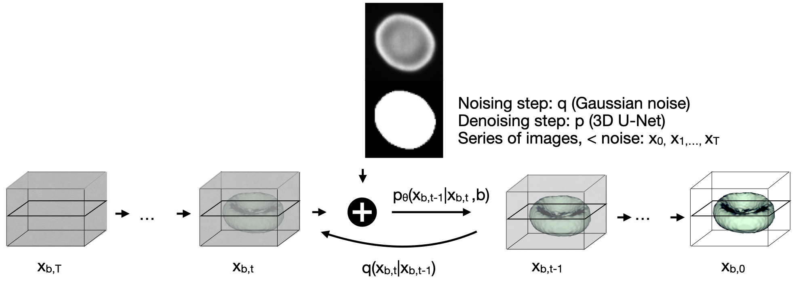

# A Diffusion Model Predicts 3D Shapes from 2D Microscopy Images

This repository provides the Pytorch implementation of the paper [A Diffusion Model Predicts 3D Shapes from 2D Microscopy Images](tbd)

The repositoray was adapted from Wolleb et al. [Diffusion Models for Implicit Image Segmentation Ensembles](https://arxiv.org/abs/2112.03145) who have adapted it from [openai/improved-diffusion](https://github.com/openai/improved-diffusion).
## Paper Abstract
Diffusion models are a class of generative models, showing superior performance as compared to other generative models in creating realistic images when trained on natural image datasets. We introduce DISPR, a diffusion-based model for solving the inverse problem of three-dimensional (3D) cell shape prediction from two-dimensional (2D) single cell microscopy images. 
Using the 2D microscopy image as a prior, DISPR is conditioned to predict realistic 3D shape reconstructions. To showcase the applicability of DISPR as a data augmentation tool in a feature-based single cell classification task, we extract morphological features from the cells grouped into six highly imbalanced classes. 
Adding features from predictions of DISPR to the three minority classes improved the macro F1 score from macro F1 = 55.2±4.6% to marcro F1 = 72.2±4.9%. 
With our method being the first to employ a diffusion-based model in this context, we demonstrate that diffusion models can be applied to inverse problems in 3D, and that they learn to reconstruct 3D shapes with realistic morphological features from 2D microscopy images.

<p align="center">

</p>

## Dataset

We use the red blood cell dataset published by Simionato et al. [Red blood cell phenotyping from 3D confocal images using artificial neural networks](https://journals.plos.org/ploscompbiol/article?id=10.1371/journal.pcbi.1008934), it contains 825 publicly available 3D images of red blood cells recorded with a confocal microscope. 
All cells are already segmented by Waibel et al. in [SHAPR - An AI approach to predict 3D cell shapes from 2D microscopic images](https://www.biorxiv.org/content/10.1101/2021.09.29.462353v1) and are contained in a volume of size (64,64,64) voxels. To each cell one of the following six classes is assigned: 
```
dataset
└───train
│   └───obj
│       │   imagename1.tif
│       │   imagename2.tif
│       │   ...
│   └───image
│       │   imagename1.tif
│       │   imagename2.tif
│       │   ...
│   └───mask
│       │   imagename1.tif
│       │   imagename2.tif
│       │   ...
└───test
│   └───obj
│       │   imagename4.tif
│       │   imagename5.tif
│       │   ...
│   └───image
│       │   imagename4.tif
│       │   imagename5.tif
│       │   ...
│   └───mask
│       │   imagename4.tif
│       │   imagename5.tif
│       │   ...

```

## Usage

We set the flags as follows:
```
MODEL_FLAGS="--image_size 64 --num_channels 32 --class_cond False --num_res_blocks 1 --num_heads 1 --learn_sigma True --use_scale_shift_norm False --attention_resolutions 16"
DIFFUSION_FLAGS="--diffusion_steps 1000 --noise_schedule linear --rescale_learned_sigmas False --rescale_timesteps False"
TRAIN_FLAGS="--lr 1e-4 --batch_size 1"
```
To train the segmentation model, run

```
python3 scripts/segmentation_train.py --data_dir ./data/training $TRAIN_FLAGS $MODEL_FLAGS $DIFFUSION_FLAGS
```
The model will be saved in the *results* folder.
For sampling an ensemble of 5 segmentation masks with the DDPM approach, run:

```
python scripts/segmentation_sample.py  --data_dir ./data/testing  --model_path ./results/savedmodel.pt --num_ensemble=5 $MODEL_FLAGS $DIFFUSION_FLAGS
```
The generated segmentation masks will be stored in the *results* folder.

## Citation
If you use this code, please cite

```

```
